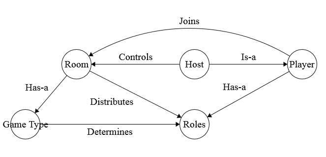
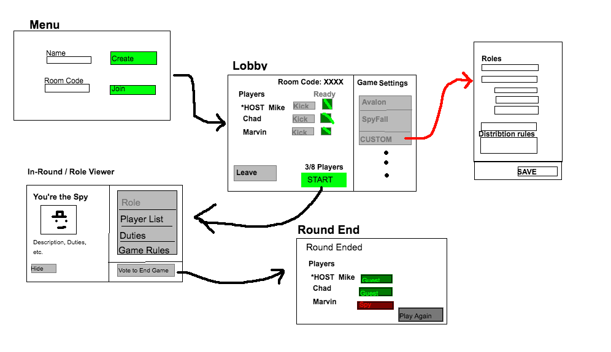

# Role Roulette

An application that assigns and distributes identities / roles to a group of players participating in a physical or analog secret-role based game.

[Project Proposal](docs/PROPOSAL.md)

COMP 4350 Group Project — Winter 2020

---

 

## Table Of Contents

- [Production Server](#production-server)
- [Project Tracking](#project-tracking)
- [Tech Stack](#tech-stack)
- [Architecture and User Flow](#architecture-and-user-flow)
  - [Data Model Diagram](#data-model-diagram)
  - [User Experience Architecture / Flow Diagram](#user-experience-architecture---flow-diagram)
- [Setting up your dev environment](#setting-up-your-dev-environment)
- [Running the application locally](#running-the-application-locally)
- [Continuous Integration](#continuous-integration)
- [API Documentation](#api-documentation)
- [Testing](#testing)
- [Linter](#linter)

* [Programming Guidelines and Review Process](#programming-guidelines-and-review-process)
  - [Programming Guidelines](#programming--guidelines)
  - [Github Workflow](#github-workflow)
    - [Branching](#branching)
    - [Pull Requests](#pull-requests)
    - [Merging Pull Requests](#merging-pull-requests)
  - [Review Process](#review-process)
  - [Review Checklist](#review-checklist)

---

 

## Production Server

To access the production version of our application please visit: [http://ec2-3-16-156-190.us-east-2.compute.amazonaws.com](http://ec2-3-16-156-190.us-east-2.compute.amazonaws.com) 

### Continuous Deployment

`TODO`: The production server will be updated with every push to master once the action script is added. For now, the deployment will be done manually.

## Project Tracking

[Trello board](https://trello.com/invite/b/gzInkoqT/2ce7f3b9a27756ef60ecd2c08d700e7f/4350-board-game)

 

## Tech Stack

- **Production Server**: AWS EC2
- **Web Application**: MERN stack
  - **Persistence:** MongoDB
  - **API:** Express JS
  - **Server Application**: Node JS
  - **Client Application:** React JS
- **Mobile Application**
  - React Native

 

## Architecture and User Flow

### Data Model Diagram

### User Experience Architecture / Flow Diagram

---

 

## Setting up your dev environment

### 1. Installing Node

First, ensure you have Node.js and npm installed on your machine. You can check this by opening your terminal and typing `node -v` and `npm -v`. If these commands aren't recognized, you will need to install Node.js and npm.

[Follow the guide here to install Node.js and npm](https://docs.npmjs.com/downloading-and-installing-node-js-and-npm)

### 2. Cloning the Repo

Install git, or GitHub desktop on your machine if you haven't already, and clone the repo. For instructions, see the guide [here](https://help.github.com/en/github/creating-cloning-and-archiving-repositories/cloning-a-repository)

### 3. Installing Dependencies

Open your terminal to the root folder (this folder) of the repository, and enter `npm install` to acquire all the project's dependencies.

**Troubleshooting:** If the install failed, try entering the same command, `npm install` within both the `/backend` and `/client` repositories.

 

## Running the application locally

To run the application, you can run the server (`/backend`), which will run the latest built version of the client, or run the client (`/client`) which will run the client dynamically, responsive to any front-end changes.

Alternatively, the following scripts are available from this root directory to run either or both components:

### Available Scripts

### `npm start`

Builds the client app, then runs the server. Open [http://localhost:3000](http://localhost:3000) to view it in the browser.

### `npm run build`

Builds the client app to the `build` folder, ready to be served.

### `npm run server`

Runs the app backend, serving the latest app build. _(Must build the app before running — see `run build`)_ 
Open [http://localhost:3000](http://localhost:3000) to view it in the browser.

### `num run client`

Runs the client app. This allows dynamic updating 
Open [http://localhost:3000](http://localhost:3000) to view it in the browser.

---

 

## Continuous Integration

`.github/workflows/nodejs.yml`

This Continuous integration action script will run checks on any active pull request to ensure that the application installs correctly, builds without error, passes all tests, and runs without error. Pull requests that do not pass one of these checks will not be able to be merged.

This is a safeguard to ensure our `develop` and `master` branches are always in working order.

 

## API Documentation

`TODO`. For now;

- See `/backend/models` for schema models.
- See `/backend/routes` for the API methods, and the `const` variables in each route for the request arguments

 

## Testing

### `npm test`

Runs all test suites in client, backend, and mobile packages. See `README.md` in the `/client`, `/backend`, and `/mobile` directories for testing each package individually.

**JEST** is our testing framework. See the JEST documentation on getting started [here](https://jestjs.io/docs/en/getting-started.html).

The client tests are located at `/client/test`, and the server tests are located at `/backend/test`

 

## Linter

### ESLint

**ESLint** is our linting framework. The configuration file can be found at `/.eslintrc`.

**To Run ESLint**, run `eslint "**.js"` from within the directory your files are in. Or run `eslint myfile.js` to run the linter on your file.

See ESLint documentation [here](https://eslint.org/docs/user-guide/getting-started) for more details.

### Prettier

If you're using Visual Studio Code as your coding environment, you can install the `Prettier - Code Formatter` extension to auto-format your code according to the ESLint guidelines. [See here](https://prettier.io/docs/en/integrating-with-linters.html)

 

---

 

# Programming Guidelines and Review Process

 

## Programming Guidelines

**General**

- Variable names are informative
- Variable name formatting is consistent (camelCase)
- Functions are modular as possible (Maximum 40 lines)
- Code can be reasonably understood, comments are provided otherwise
  - (Try to write code in such a way that it can be understood without comments)
- Avoid obvious code smells
- Architecturally sound (Folder structure is organized)

**Testing**

- Try to make tests as you’re developing (or follow TDD)
- Test all edge cases

 

## Github Workflow

**`master`**

- Our “Snap-shottable” branch
- Always in good condition (not broken)

**`develop`**

- The base branch for development
- Commits are merged non-squashed into master.
- **Branches will be merged into master when they have been verified (tested) by a second party (not the author of a branch)** See the `Completed - Develop` category on the Trello board for tasks waiting to be merged into master ASAP.

### Branching

- Each user story will be developed on a branch from `develop`
- Each dev task collection of a user story will be a branch off of the larger user story
- Merges into `develop` and user story branches must be squashed

### Pull Requests

- Must be done any time you want to merge your branch (dev task) into the user story branch, or from user story branch into develop

### Merging Pull Requests

- Must pass the review process below before it can be merged
- Remember to delete your branches after they’ve been merged
- Remember to ensure your project runs and passes tests before submitting a pull request, and before merging
- Ensure your branch is up to date with the target branch before merging
- Merge Conflicts
  - Using a merge conflict helper tool is recommended (ex. GitHub site/desktop)
  - Think through the merge conflicts. If you’re unsure, ask the person who wrote the conflicting lines, or post a message in slack for anyone to help

 

---

 

## Review Process

- Every pull request must be **approved** by 2 other members
- A Review will involve looking in the `diff` for violations of the criteria below
- Reviewers will run the project at that branch to verify everything works as intended
- Reviewers will give feedback/suggestions on the pull requests, and **approve** them only when their feedback has been addressed/dismissed

 

## Review Checklist

- Link to the Tello item is given in the PR description, along with a very brief overall summary
- Passes all task-specific acceptance criteria listed in the Trello item
  - (Everything outlined in the task/story description is either finished, or an explanation why it wasn’t implemented is provided)
- The app can be run, the changes can be observed in-app (if applicable)
- **Code meets all programming practices above**
- Code passes linter
- Must have thorough enough testing (~70% Coverage)
  - The code is written to be testable (ex. you can use dependency injection)
  - Edge cases are tested.
- Passes all GitHub CI checks
